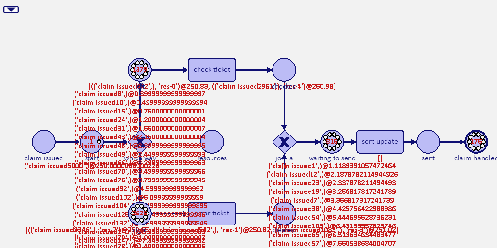

# Performance Testing for SIMpn

This contains the general notes about the performance testing that has 
been conducted to ensure that for unstable simulations (where tokens 
build up in places) can run in a timely manner. The bulk of the initial 
testing is recorded in the following repo for a seperate simulation using 
SIMpn [simulation testing](https://github.com/AdamBanham/the-scheme-simpn)

For demonstration purposes, we can use `cProfile` to take a look at the core 
compontents of a simulation that can potentially cause increasing delays
between steps of a simulation. To demonstrate the possible impact on 
simulations, we consider a prepared simulation in 
[unstable.py](./sim/unstable.py).

Running cProfile on a python script:
```bash
py -m cProfile [-o out.prof] [target script]
```

The simulation consists of an overloaded process with a restricted resource
pool. Thus, tokens quickly build up because the resource pool is overloaded
and cannot perform tasks quick enough to keep up.

## Simulation 

The process consists of a initial split followed by a clean up task. After
simulating up to a duration of 250 ticks, the net has over 2000 tokens built
up, which adds the simulation step time.



## Existing performance

After simulating the exemplar process for 250 ticks using the implementation
of the `SimProblem` as of this commit 519eb47e8ce2503de4b31df916952f9704170e0e, 
we have the following state on the net in terms of tokens.


The runtime of five runs of the process simulation was :
- 12.87 seconds
- 10.84 seconds
- 11.76 seconds
- 11.79 seconds
- 11.15 seconds
- avgerage: 11.68

So we can see that many more tokens and possible combinations of firings
are possible at the next tick. This is where the problems lies, determining
out of the many possible event bindings, which are valid and which one 
could fire. In particular, the initial improvements consider if the calls 
to `event_bindings` can be reduced as highlighted by the flamegraph.

## Changes

The core runtime consideration is the calls to `event_bindings` in 
`bindings`. Which consists of three key loops, where the initial loop calls
`event_bindings` to find the `min_enabling_time`. The second generates
bindings again based on the possibly reset clock.
Lastly, the third loop filters out any bindings that are actionable 
after the current clock. 

The proposed change is to do these steps without needing
to pass all events to `event_bindings` unless we are likely to keep at least
one binding from that call in the third loop. Ideally, `event_bindings` are
called once per `t` in `self.events`.

```python
def bindings(self):
    """
    Calculates the set of timed bindings that is enabled over all events in the problem.
    Each binding is a tuple ([(place, token), (place, token), ...], time, event) that represents a single enabling binding.
    If no timed binding is enabled at the current clock time, updates the current clock time to the earliest time at which there is.
    :return: list of tuples ([(place, token), (place, token), ...], time, event)
    """
    timed_bindings = []
    min_enabling_time = None
    # first loop
    for t in self.events:
        for (binding, time) in self.event_bindings(t):
            timed_bindings.append((binding, time, t))
            if min_enabling_time is None or time < min_enabling_time:
                min_enabling_time = time
    # timed bindings are only enabled if they have time <= clock
    # if there are no such bindings, set the clock to the earliest time at which there are
    if min_enabling_time is not None and min_enabling_time > self.clock:
        self.clock = min_enabling_time
        # second loop
        timed_bindings = [] 
        for t in self.events:
            for (binding, time) in self.event_bindings(t):
                timed_bindings.append((binding, time, t))

    # third loop
    return [(binding, time, t) for (binding, time, t) in timed_bindings if time <= self.clock]
```

The changed `bindings` definition is as follows:

```python
def bindings(self):
    """
    Calculates the set of timed bindings that is enabled over all events in the problem.
    Each binding is a tuple ([(place, token), (place, token), ...], time, event) that represents a single enabling binding.
    If no timed binding is enabled at the current clock time, updates the current clock time to the earliest time at which there is.
    :return: list of tuples ([(place, token), (place, token), ...], time, event)
    """
    min_enabling_time = None

    # find the smallest largest enabling time for an event's
    # incoming markings
    timings = dict()
    for ev in self.events:
        smallest = []
        skip = False
        added = False

        # identify when the earlier token could be used from places of the event
        for place in ev.incoming:
            try:
                smallest.append(place.marking[0].time)
                added = True
            except:
                skip = True
        
        if (skip or not added):
            timings[ev] = 0
            continue
        
        # only keep the latest of the set of early tokens across places
        smallest_largest = max(smallest)
        timings[ev] = smallest_largest

        if (smallest_largest == 0):
            continue

        # keep track of the smallest next possible clock
        if (smallest_largest is not None) \
            and (min_enabling_time is None \
                    or smallest_largest < min_enabling_time):
            min_enabling_time = smallest_largest 

    # timed bindings are only enabled if they have time <= clock
    # if there are no such bindings, set the clock to the earliest time at which there are
    if min_enabling_time is not None and min_enabling_time > self.clock:
        self.clock = min_enabling_time
    # We generate bindings and only do so if an event would produce a 
    # binding before the current clock
    timed_bindings = [] 
    for t, earlist in timings.items():
        if earlist > self.clock:
            continue
        for (binding, time) in self.event_bindings(t):
            if (time <= self.clock):
                timed_bindings.append((binding, time, t))
    # now return the untimed bindings + the timed bindings that have time <= clock
    return timed_bindings
```

The changes focus on only calling `event_bindings` on events that could 
produce a binding before the current clock and only once. The first loop
collects information about the timings of tokens in the incoming markings
of an event to determine whether they can fire before the current clock.

## Performance Change

Rerunning the simulation for 250 ticks we see the following runtimes:
- 7.98 seconds
- 7.71 seconds
- 8.39 seconds
- 8.57 seconds
- 8.59 seconds
- average: 8.248 / speedup : 1.41

Revisiting the flame graph:


In the general case, these optimisations are just a set of heavy pruning steps to ensure that we don't need to do as much work. A similar approach could be taken within `event_bindings` but for moment the initial improvements are fine.

## Performance Change with Delayed Tokens

Another part of the showing the improvements is when we have tokens that are delayed. To demonstrate, `unstable-with-delays.py` was used where some tokens are now delayed before they can be used.

Flame graph for original `bindings`:


Runtimes:
- 10.49
- 10.56
- 10.32
- 10.85
- 10.91
- average: 10.626

Flame graph for optimised `bindings`:


Runtimes:
- 7.99
- 7.88
- 7.99
- 7.83
- 8.25

A further step can be taken to limit the calls need for the `.append` in 
the python code for `event_bindings`. Which seems to take up over half the 
time of the internal `tokens_combinations`. 

Flame graph for optimised `bindings` and `event_bindings`:


Runtimes:
- 4.03
- 4.07
- 4.08
- 4.04
- 3.93
- average : 4.03 / speedup 2.63: 

# Final thoughts (31/08/2025)

These improvements are unlikely to be that noticable in **stable** simulations,
where total token count does not grow beyond the possible number of events.
However, in cases where the arrival rate exceeds events, these pruning steps
will prevent a lot of work that only gets filtered out by the `bindings` 
function. A side note is that using lazy generators means that less calls 
to the expensive `append` on lists will be avoided. The `append` function
for long lists should be avoided as much as possible.

As a further step of optimisations, we could consider keeping all bindings
in a single collection rather than recomputing them with each step. If a 
firing takes tokens, then any bindings using these tokens are invalidated,
while a new set of valid bindings are produced after firing occurs. This
may prune further work for bindings unaffected by firing of another. However,
this will complicated the simulation process.